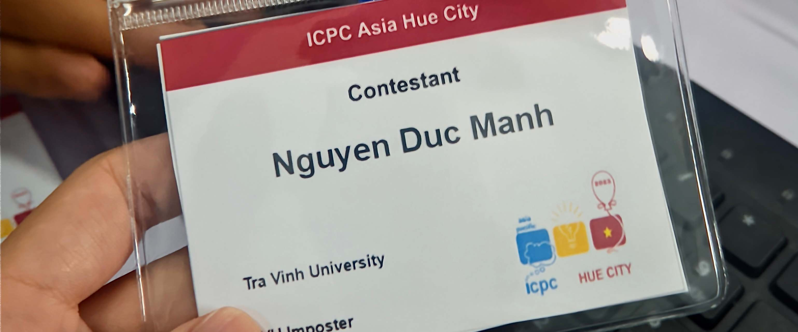

<h2>Duc Manh, hello everyone!</h2>

<!-- ## 👋 &nbsp;Duc Manh, Hello everyone! -->

### 👨🏻‍💻 &nbsp;About Me

💡 &nbsp;I like to explore new technologies and develop software solutions and quick hacks.\

🎓 &nbsp;I'm currently studying information technology at Tra Vinh University..\

🌱 &nbsp;I am expanding my web major to IOT, smart home devices and future cross-platform research with a focus on websites..\

💬 &nbsp;Feel free to reach out to me for pro bono consulting and volunteering, or just for some interesting discussion.\ 

📄 &nbsp;Please have a look at my [dnmanh](https://www.dnmanh.io.vn) for more details about me. I'm open to feedback and suggestions!

### 🛠 &nbsp;Tech Stack

&nbsp;
&nbsp;
&nbsp;
&nbsp;
&nbsp;
&nbsp;
&nbsp;
\
&nbsp; 
&nbsp;
&nbsp;
&nbsp;
&nbsp;

### ⚙️ &nbsp;GitHub Analytics

### 🤝🏻 &nbsp;Connect with Me

